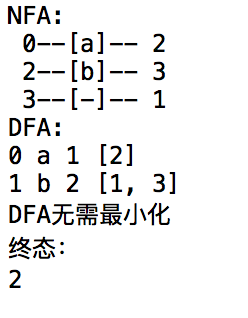
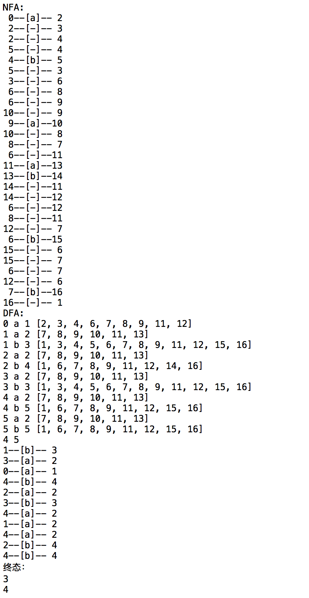
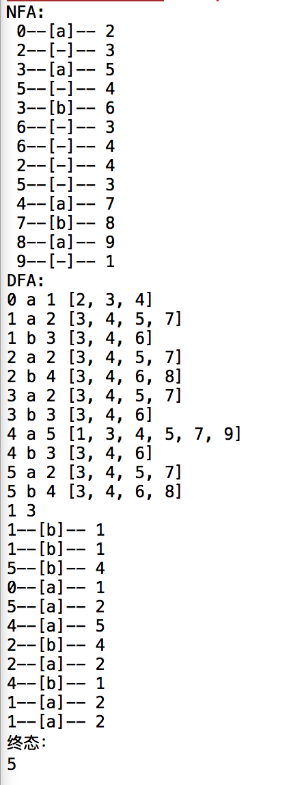

## 【编译原理】第一次实验报告

### 类的设计
由于python中没有结构体，在三个py中准备了5个类

**以下所有类都有__init__函数用于初始化，不再特意标明。**

* Connect 用于存图（自动机中的连线）

|名字|用途|类型|
|--------|--------|-----|
|ID|连线起始点|实例变量|
|input|经过哪一输入（如：a，b或-）|实例变量|
|next_Input|连线终点|实例变量|

* Subsets 用于存子集

|名字|用途|类型|
|--------|--------|-----|
|sub_ID|连线起始点|类变量|
|nodes|子集中包含的状态|实例变量|
|already|是否已被访问过|实例变量|
|id|子集的标号|实例变量|

* NFA
 
|名字|用途|类型|
|--------|--------|-----|
|string|正则表达式|实例变量|
|graph|存储NFA图的列表（元素类型为Connect）|实例变量|
|total|图中的元素总数|实例变量|
|convert|正则式转换为NFA|函数|
|printNFA|按格式打印NFA的graph|函数|

* DFA
 
|名字|用途|类型|
|--------|--------|-----|
|nfa|存储NFA的graph|实例变量|
|graph|存储DFA图的列表（元素类型为Connect）|实例变量|
|accpet|存储为终态的状态|实例变量|
|no|存储为非终态的状态|实例变量|
|eclosure|传入状态集，返回其e闭包|函数|
|move|传入状态集和一个字符，返回从该状态、通过该字符能到达的状态集|函数|
|printDFA|按格式打印DFA的graph|函数|

* MINI

|名字|用途|类型|
|--------|--------|-----|
|dfa|存储DFA的graph|实例变量|
|accpet|存储为终态的状态，同DFA的accept|实例变量|
|no|存储为非终态的状态，同DFA的no|实例变量|
|move|类似DFA的move，但只处理单状态|函数|
|substitute|将可以化简的两个状态合并，更改graph中的连线|函数|
|minimize|最小化|函数|


### 正则式转NFA

由于没有利用递归，也没有像数据结构中完成后缀表达式之类实验时对字符串中的字符进行压栈操作（虽然这样确实更简便，也会让代码更明了），本代码强行“暴力分类讨论”</br>

设置两个栈start和end，分别表示每对括号的开始和结束状态，默认整个正则表达式外也有一对括号</br>
（实际实现时手动添加0状态作为开始，1状态作为结束，并在表达式最后添加"）"</br>

简述遍历正则式中的字符时需要分类讨论的内容：
>
1. 开始时，start和end各添加一个状态（已手动完成）
2. 遇到“(”，当前状态入start栈，添加一个状态入end栈
3. 遇到“*”，如果之前为右括号，则弹出一对start和end，当前状态连接end、当前状态连接之前在对应左括号后或者括号间的“|”后的状态、start连接end。如果之前不是右括号则类似，操作更为简单。
4. 遇到”|“，将当前状态与最后一个入栈end的状态相连，当前状态变为最后一个入栈start的状态
5. 遇到“）”，end弹出最后一个入栈的状态与当前状态相连

**实际完成分类讨论时为适用足够多的正则式，并未严格按照该思路，部分操作调换了位置**

### NFA转DFA （确定化）

按照课本上e-closure和move的思路，创建NFA状态合集的子集

### DFA转MFA （最小化）

并未使用课本上描述的分割法，而是反过来使用了合并法。如果两个状态都为终态/非终态，且处理每个字符时转移到的状态都相同，则认为二者可以合并，去graph中用一个取代另一个。

### 示例

```bash
ab
```


```bash
ab*(a*|(ab)*|b)*b
```




```bash
a(a|b)*aba
```




